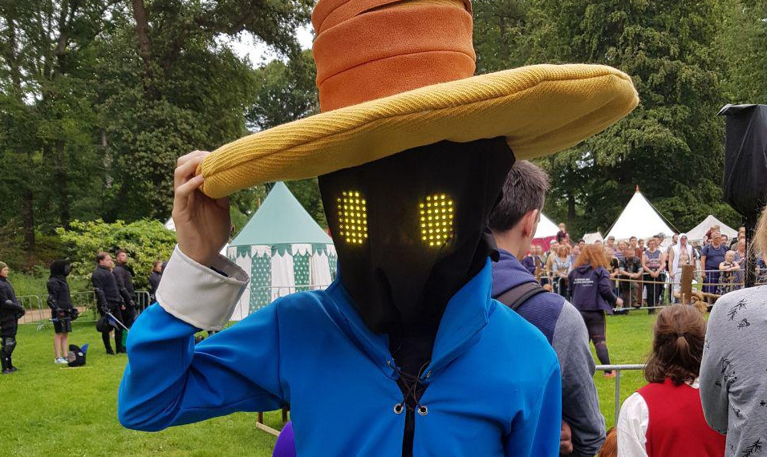
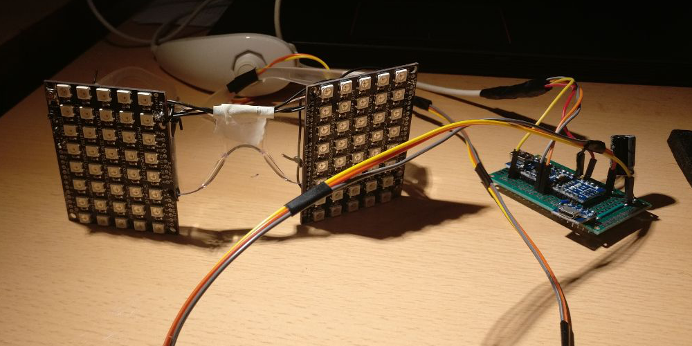

## vivi-eyes

(Click for a video demonstration). 

`vivi-eyes` is the project that generates an [Arduino](https://www.arduino.cc/) code file for use on my Arduino Nano. It reads face files and translates them to C code that can be compiled and flashed onto the Arduino. These face files can be selected on the fly by means of a Nintendo Nunchuk connected to the Arduino, allowing me to select different expressions according to the situation.

### Parts

I used the following parts, but you can replace them with compatible components where possible. I am including a link to the online store where I got my parts where possible (usually located in The Netherlands).
* [Arduino Nano V3.0 Compatible](https://www.tinytronics.nl/shop/nl/arduino/main-boards/nano-v3.0-compatible-losse-headers)
* [WS2812B Digital 5050 RGB LED - Shield 40 LEDS - 8x5 Matrix](https://www.tinytronics.nl/shop/nl/verlichting/led-digitaal/ws2812b-digitale-5050-rgb-led-shield-40-leds-8x5-matrix)
* [Nintendo Wii Nunchuk](https://en.wikipedia.org/wiki/Wii_Remote#Nunchuk)
* [Micro USB Dip adapter](https://www.tinytronics.nl/shop/nl/diversen/overige/micro-usb-dip-adapter)

TODO: circuit diagram and circuit explanation

### Execution

TODO include diagram of face file to PPM to glasses.

* Use `./gradlew run` (Unix-like) or `gradlew.bat run` (Windows).
   * This will parse all faces found in `./src/main/resources/`.
   * In `./out`, you will find `ppm` files that show a preview of what the face will look like on the glasses.
   * `arduino.ino` will be generated, which can be copy and pasted into the Arduino IDE.